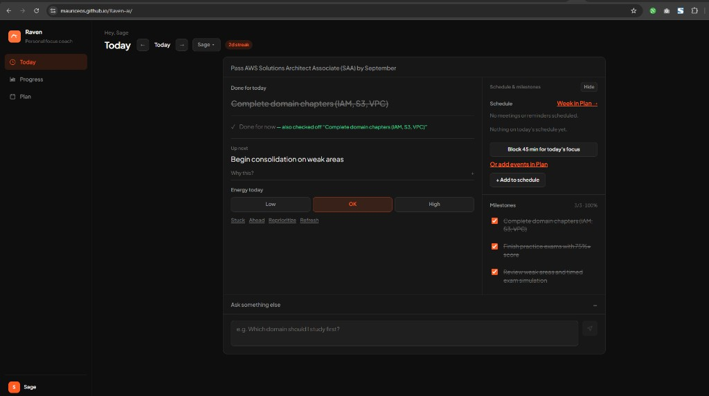
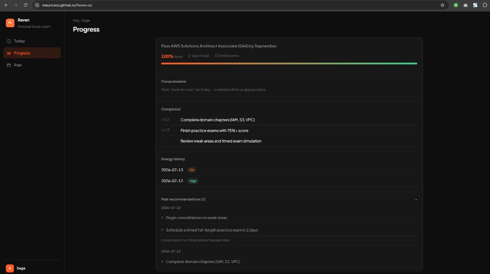
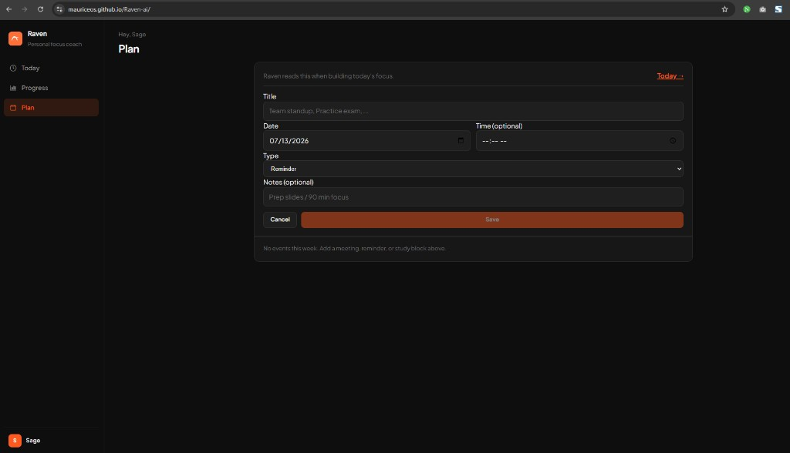
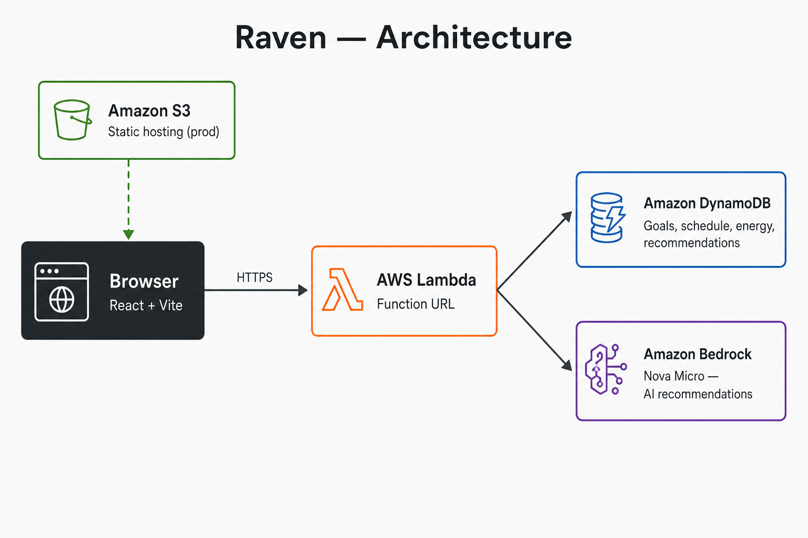

# Raven

**One question:** What should I focus on today?

Raven reads your goal, milestones, energy, and schedule — then returns a daily focus recommendation via Amazon Bedrock (Nova Micro).

**Repo:** [github.com/MauriceOS/Raven-ai](https://github.com/MauriceOS/Raven-ai)  
**Live demo:** [mauriceos.github.io/Raven-ai](https://mauriceos.github.io/Raven-ai)

## Desktop view

### Today
Daily focus, energy check-in, schedule, and milestones.



### Progress
Focus sessions, completed milestones, energy history, and past recommendations.



### Plan
Week schedule Raven reads when building today's focus.



## Architecture



| Service | Role |
|---------|------|
| **React (Vite)** | Today, Progress, and Plan UI |
| **GitHub Pages** | Public frontend hosting (free) |
| **AWS Lambda** | API — goals, energy, schedule, recommendations |
| **Lambda Function URL** | HTTPS endpoint (no API Gateway) |
| **Amazon DynamoDB** | Single-table storage |
| **Amazon Bedrock** | Nova Micro — daily focus + follow-up chat |

## Quick start

**Backend:** [docs/DEPLOY.md](docs/DEPLOY.md)

**Frontend (local):**

```powershell
cd frontend
copy .env.example .env
# Set VITE_API_URL to your Lambda Function URL (no trailing slash)

npm install
npm run dev
```

Open http://localhost:5173

**Frontend (GitHub Pages):** [docs/DEPLOY.md#github-pages](docs/DEPLOY.md#github-pages)
